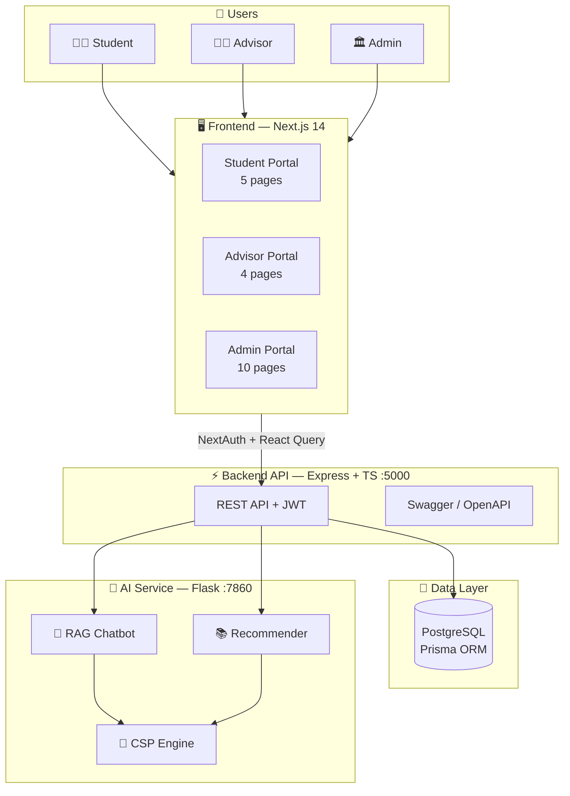
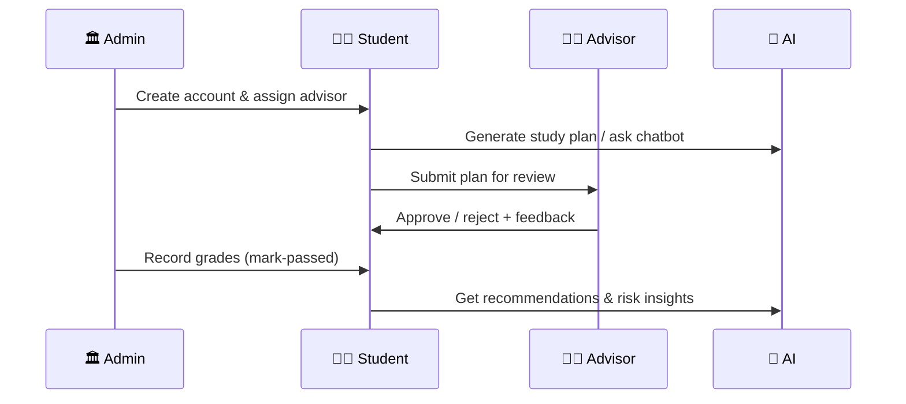

<!-- Banner -->
<p align="center">
  
</p>

<p align="center">
  
</p>

<p align="center">
  
  
  
</p>

<p align="center">
  <em>Smart academic guidance · Study planning · Course recommendations · Risk analysis — powered by AI &amp; grounded in EELU IT/AI Bylaws 2021</em>
</p>

<br>

<!-- Tech Badges -->
<p align="center">
  <strong>🖥️ Frontend</strong><br><br>
  
  
  
  
  
  
  
  
</p>

<p align="center">
  <strong>⚡ Backend</strong><br><br>
  
  
  
  
  
  
</p>

<p align="center">
  <strong>🧠 AI Service</strong><br><br>
  
  
  
  
  
  
</p>

<p align="center">
  <a href="docs/PROJECT_SHOWCASE.html">
    
  </a>
</p>

---

## 📑 Table of Contents

| | |
|:--|:--|
| 🏠 [Overview](#-overview) | 🏗️ [Architecture](#️-system-architecture) |
| 📊 [At a Glance](#-at-a-glance) | ✨ [Core Features](#-core-features) |
| 🛠️ [Tech Stack](#️-technology-stack) | 📂 [Project Structure](#-project-structure) |
| 👥 [Roles](#-roles--permissions) | 🔌 [API Reference](#-api-reference) |
| 🗄️ [Database](#️-database-design) | ⚙️ [Environment](#️-environment-variables) |
| 🚀 [Setup](#-installation--setup) | 🐳 [Docker](#-docker-deployment) |
| 🧪 [Testing](#-testing) | 🔧 [Troubleshooting](#-troubleshooting) |
| 👨‍💻 [Team](#-project-team) | 🔮 [Future](#-future-enhancements) |

---

## 🏠 Overview

<table>
<tr>
<td width="60" align="center">🎓</td>
<td>

**Cogni-Advisor** is a full-stack AI-powered academic advising platform for the **Egyptian E-Learning University (EELU)**. It connects students, advisors, and administrators through a modern web experience backed by intelligent automation.

</td>
</tr>
</table>

The system is built as **three cooperating services**:

| Layer | Stack | Port |
|-------|-------|------|
| 🖥️ **Frontend** | Next.js 14 · React 18 · Tailwind CSS | `3002` |
| ⚡ **Backend API** | Node.js · Express · TypeScript · Prisma | `5000` |
| 🤖 **AI Service** | Python · Flask · LangChain · FAISS | `7860` |

> 📖 **Interactive presentation for supervisors:** open [`docs/PROJECT_SHOWCASE.html`](docs/PROJECT_SHOWCASE.html) in your browser for the animated visual overview.

---

## 📊 At a Glance

<p align="center">

| 👥 **8** | 🧠 **5** | 🔐 **3** | 🔌 **30+** | 📄 **20+** |
|:---:|:---:|:---:|:---:|:---:|
| Team Members | AI Modules | User Roles | API Endpoints | Frontend Pages |

</p>

| Service | URL |
|---------|-----|
| 🖥️ Frontend | `http://localhost:3002` |
| ⚡ Backend | `http://localhost:5000` |
| 📚 Swagger | `http://localhost:5000/api-docs` |
| 🤖 AI Service | `http://localhost:7860` |

---

## 🏗️ System Architecture



### 🤖 AI Service Modules

| Module | Icon | Description |
|--------|------|-------------|
| `chatBot/` | 💬 | RAG Q&A over EELU bylaws — LangChain + FAISS + `BAAI/bge-base-en-v1.5` + Gemini |
| `recommendation/` | 📊 | Constraint-satisfaction course recommender with prerequisite graph |
| `recommendation/data/` | 📁 | Course catalog, policy rules, IT/AI track catalogs |

---

## ✨ Core Features

<table>
<tr>
<td width="50%" valign="top">

### 🤖 AI Chatbot (RAG)
Academic assistant answering regulation & curriculum questions using retrieval-augmented generation.

`LangChain` · `FAISS` · `Gemini` · `HuggingFace`

---

### 📊 GPA Prediction & Risk Analysis
Predicts cumulative GPA and flags at-risk students from academic history.

`Risk Analysis` · `Analytics` · `Alerts`

---

### 📚 Course Recommender
Analyzes prerequisites, GPA bands, and credit caps to suggest optimal courses.

`CSP` · `Graph Analysis` · `EELU Policy`

</td>
<td width="50%" valign="top">

### 📝 Study Plan AI
Auto-generates semester plans with advisor review & approval workflow.

`Auto-Generate` · `Submit` · `Approve/Reject`

---

### 💬 Messaging & Notifications
Student–advisor messaging, in-app alerts, email OTP password reset.

`Resend` · `OTP` · `Sonner Toasts`

---

### 🔐 JWT Auth + RBAC
Role-based access for Student, Advisor, and Admin portals.

`JWT` · `Helmet` · `Zod` · `Rate Limiting`

</td>
</tr>
</table>

---

## 🛠️ Technology Stack

### 🖥️ Frontend (`cogni-advisor-frontend`)

| Component | Technology |
|-----------|------------|
| Framework | **Next.js 14** (App Router) |
| UI Library | **React 18** |
| Language | **TypeScript 5.9** |
| Styling | **Tailwind CSS** |
| Authentication | **NextAuth.js v4** (Credentials Provider) |
| Data Fetching | **TanStack React Query** |
| Forms | **React Hook Form** + **Zod** |
| UI Primitives | **Radix UI** + **CVA** |
| Notifications | **Sonner** (toast) |
| Route Protection | Next.js **Middleware** |

#### Frontend Portals (20+ pages)

| Portal | Pages | Highlights |
|--------|-------|------------|
| 👨‍🎓 **Student** | Dashboard · Study Plan · Transcript · AI Chat · Messages | AI plan generation, chatbot, academic summary |
| 👨‍🏫 **Advisor** | Dashboard · Students · Study Plans · Messages | Plan review, risk monitoring, feedback |
| 🏛 **Admin** | Dashboard · Users · Courses · Semesters · Grades · Advisors · Settings | Full system management, bulk grade upload |

---

### ⚡ Backend

| Component | Technology |
|-----------|------------|
| Runtime | Node.js 20+ |
| Framework | Express 5 |
| Language | TypeScript 5.9 |
| ORM | Prisma 6 |
| Database | PostgreSQL 16 (Supabase-compatible) |
| Auth | JWT (24-hour expiry) |
| Validation | Zod 4 |
| Docs | Swagger / OpenAPI 3.0 |
| Security | Helmet · CORS · Rate Limiting |
| Email | Resend |
| Testing | Vitest 4 + Supertest |

---

### 🤖 AI Service

| Component | Technology |
|-----------|------------|
| Language | Python 3.11 |
| Framework | Flask + Gunicorn |
| RAG | LangChain |
| Vector Store | FAISS |
| Embeddings | `BAAI/bge-base-en-v1.5` |
| LLM | Gemini (`gemini-flash-latest`) / OpenRouter |

---

## 📂 Project Structure

```text
Cogni-Advisor/
│
├── cogni-advisor-frontend/     # 🖥️ Next.js 14 web application
│   └── src/
│       ├── app/                # Student · Advisor · Admin portals
│       ├── components/         # UI (Radix) + Layout shells
│       ├── lib/actions/        # Server Actions (7 modules)
│       └── auth.ts             # NextAuth config
│
├── src/                        # ⚡ Backend API
│   ├── controllers/ · services/ · routes/
│   ├── generators/             # AI study plan generator
│   └── scripts/                # Seed & test scripts
│
├── cogni-advisor-ai/GP/        # 🤖 Python AI service
│   ├── chatBot/                # RAG pipeline
│   └── recommendation/         # Course recommender
│
├── prisma/                     # 💾 Database schema & migrations
├── docs/                       # 📚 Documentation + showcase
└── docker-compose.yml
```

---

## 👥 Roles & Permissions

| Role | Icon | Capabilities |
|------|------|-------------|
| **STUDENT** | 👨‍🎓 | Study plans · AI chat · Recommendations · Messaging |
| **ADVISOR** | 👨‍🏫 | Dashboard · Plan review · Risk analysis · Feedback |
| **ADMIN** | 🏛 | Users · Courses · Semesters · Grades · Settings |

---

## 🔌 API Reference

**Base URL:** `http://localhost:5000` · **Auth:** `Authorization: Bearer <token>`

<details>
<summary><strong>🔐 Authentication</strong></summary>

| Method | Endpoint |
|--------|----------|
| `POST` | `/api/auth/login` |
| `GET` | `/api/auth/me` |
| `PATCH` | `/api/auth/change-password` |

```bash
curl -X POST http://localhost:5000/api/auth/login \
  -H "Content-Type: application/json" \
  -d '{"identifier":"student@eelu.edu.eg","password":"yourpassword","role":"STUDENT"}'
```

</details>

<details>
<summary><strong>👨‍🎓 Student Endpoints</strong></summary>

| Method | Endpoint |
|--------|----------|
| `GET` | `/api/students/me` · `/api/students/me/summary` |
| `POST` | `/api/study-plan` · `/api/ai/chat` · `/api/ai/suggest-plan` · `/api/ai/predict-gpa` |
| `GET` | `/api/study-plan/generate` · `/api/recommendations` · `/api/ai/history` |
| `PATCH` | `/api/study-plan/:id/submit` |

</details>

<details>
<summary><strong>👨‍🏫 Advisor Endpoints</strong></summary>

| Method | Endpoint |
|--------|----------|
| `GET` | `/api/advisor/dashboard` · `/api/advisor/students` |
| `PATCH` | `/api/study-plan/:id/review` |
| `GET` | `/api/ai/risk-analysis/:studentId` |
| `GET` | `/api/advisor/messages/conversations` |

</details>

<details>
<summary><strong>🏛 Admin Endpoints</strong></summary>

| Method | Endpoint |
|--------|----------|
| CRUD | `/api/users` · `/api/courses` · `/api/semesters` |
| `PATCH` | `/api/enrollments/mark-passed` |
| `GET/PATCH` | `/api/admin/system-settings` · `/api/admin/overview` |

</details>

<details>
<summary><strong>🤖 AI Service (direct :7860)</strong></summary>

| Method | Endpoint |
|--------|----------|
| `GET` | `/health` · `/chatbot/chatbot` |
| `POST` | `/chatbot/api/ask` · `/recommendation/api/recommend` |

</details>

---

## 🗄️ Database Design

| Category | Models |
|----------|--------|
| 👤 Core | `User` · `Student` · `Advisor` · `Admin` · `Course` · `Enrollment` |
| 📝 Planning | `StudyPlan` · `StudyPlanCourse` · `SemesterRecord` · `GraduationProgress` |
| 💬 Communication | `Message` · `Notification` · `Feedback` |
| 🤖 AI | `AIInteraction` · `Alert` · `CourseReview` |
| 🔒 Security | `PasswordResetToken` · `AuditLog` · `SystemSetting` |

```bash
npx prisma migrate dev    # Apply migrations
npx prisma studio         # Visual DB browser
```

---

## ⚙️ Environment Variables

<details>
<summary><strong>🖥️ Frontend (<code>cogni-advisor-frontend/.env</code>)</strong></summary>

```env
COGNI_API_BASE_URL=http://localhost:5000
NEXTAUTH_URL=http://localhost:3002
NEXTAUTH_SECRET=change-me-in-production
```

</details>

<details>
<summary><strong>⚡ Backend (<code>.env</code>)</strong></summary>

```env
PORT=5000
DATABASE_URL=postgresql://...
DIRECT_URL=postgresql://...
JWT_SECRET=your-secret
ALLOWED_ORIGINS=http://localhost:3002,http://localhost:3000
COGNI_ADVISOR_AI_ENABLED=1
COGNI_ADVISOR_AI_BASE_URL=http://localhost:7860
RESEND_API_KEY=
FRONTEND_URL=http://localhost:3002
```

</details>

<details>
<summary><strong>🤖 AI Service (<code>cogni-advisor-ai/GP/.env</code>)</strong></summary>

```env
GEMINI_API_KEY=your_key_here
GEMINI_MODEL=gemini-flash-latest
EELU_PORT=7860
EELU_PRELOAD=1
```

</details>

---

## 🚀 Installation & Setup

### Prerequisites

`Node.js 20+` · `Python 3.11` · `PostgreSQL 16` · `Gemini API Key`

### 1️⃣ Backend

```bash
npm install && cp .env.example .env
npx prisma migrate dev && npx prisma generate
npm run dev                    # → http://localhost:5000
```

### 2️⃣ AI Service

```bash
cd cogni-advisor-ai/GP
python -m venv .venv && .\.venv\Scripts\Activate.ps1   # Windows
pip install -r requirements.txt && cp .env.example .env
python run_app.py              # → http://localhost:7860
```

> ⏳ First startup: **5–15 min** for model preload. Fast mode: `$env:EELU_PRELOAD="0"; python run_app.py`

### 3️⃣ Frontend

```bash
cd cogni-advisor-frontend
npm install && cp .env.example .env
npm run dev                    # → http://localhost:3002
```

### 🌱 Seed Scripts

```bash
npx tsx src/scripts/seed_courses.ts
npx tsx src/scripts/seed_students_by_level.ts
npx tsx src/scripts/run_semester_setup.ts
```

---

## 🐳 Docker Deployment

```bash
docker compose up --build
```

| Service | URL |
|---------|-----|
| ⚡ Backend | `http://localhost:5000` |
| 🤖 AI | `http://localhost:7860` |

---

## 🧪 Testing

```bash
npm test                       # ✅ Unit + integration
npm run test:e2e               # 🔄 End-to-end
npm run test:frontend-smoke    # 🖥️ Frontend API paths
```

---

## 🔄 Typical Workflow



---

## 🔧 Troubleshooting

| ⚠️ Problem | ✅ Solution |
|-----------|------------|
| AI hangs on startup | Wait 5–15 min or set `EELU_PRELOAD=0` |
| AI not connected | Run Flask on `:7860`, set `COGNI_ADVISOR_AI_ENABLED=1` |
| Chat unavailable | Add `GEMINI_API_KEY` to AI `.env` |
| CORS error | Add frontend URL to `ALLOWED_ORIGINS` |
| Login fails | Use **university email**, not personal email |

---

## 👨‍💻 Project Team

<p align="center">

| | | | |
|:---:|:---:|:---:|:---:|
| **RR**<br>Rahma Rabie Eid<br>`#2202599` | **RH**<br>Radwa Hamada Said<br>`#2101903` | **MA**<br>Mazen Ahmed Mohamed<br>`#2200703` | **WA**<br>Wahid Ahmed Mohamed<br>`#2200905` |
| **AT**<br>Abdelrahman Tarek<br>`#2200895` | **AS**<br>Abdallah Sultan<br>`#2200929` | **AE**<br>Ahmed Emad Mohamed<br>`#2102419` | **AM**<br>Abdulrahman Mohamed<br>`#2200704` |

</p>

### 🎓 Supervision

| Role | Name |
|------|------|
| 👨‍🏫 Academic Supervisor | **Dr. Yasser Abdelhamid** |
| 👩‍💻 Assistant Supervisor | **Eng. Shrouk Abdelwence** |

---

## 🔮 Future Enhancements

| | |
|:--|:--|
| 📱 Mobile Application | 🧠 Fine-Tuned Arabic Academic LLM |
| 📈 Predictive Academic Analytics | 🔔 Real-Time Notifications (WebSocket) |
| 🎓 Advanced Graduation Planner | 🏫 Multi-Faculty Support |
| 📊 Learning Analytics Dashboard | 🎙️ Voice-Based Academic Assistant |

---

## 📄 License

Academic project developed for graduation requirements at the **Egyptian E-Learning University (EELU)**.

---

<p align="center">
  
  <br><br>
  <strong>Bachelor of Information Technology — Artificial Intelligence Track</strong>
</p>
